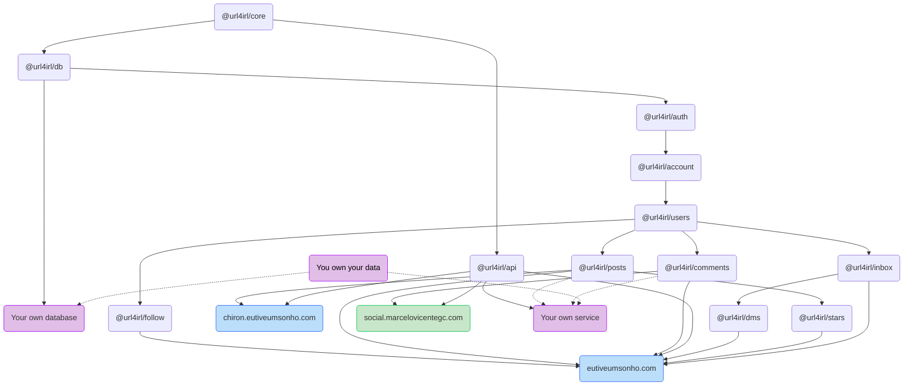

# url4irl

Surfing on the idea that:

1. Mass social networks like Instagram, Facebook, TikTok and X (prev. Twitter) have become marketing platforms, specialized in collecting data from their users to sell to third parties, and that [continue]
2. The internet can be used to connect people in a way that is not controlled by a single entity. The social networking paradigm can change to a more decentralized and meaningful model, where these platforms go from being generalist content-sharing platforms to being specialized in connecting people with similar interests while offering features that spin around these similar interests (i.e. https://eutiveumsonho.com).

The url4irl project distributes a series of libraries useful to create other projects. **The main goal of this project is to provide a set of libraries that can be used to create social networks**, but the libraries can be used to create any other kind of project.

## Packages

| Package                                          | Description                                                                                                                     |
| ------------------------------------------------ | ------------------------------------------------------------------------------------------------------------------------------- |
| [@url4irl/mongodb](./packages/mongodb/README.md) | MongoDB wrapper that provides a simple interface to interact with MongoDB databases.                                            |
| [@url4irl/users](./packages/users/README.md)     | User management package that provides a simple interface to interact with user data, providing methods to manipulate user data. |

## How does each package interact?

Below you will find a diagram that shows the libraries that are part of the project, how they interact with each other and how they can power other services.

